# rlcomp2020
This is sample source code for Reinforcement Learning Competition, hosted by FPT-Software (Hanoi, Vietnam). The game is Gold Miner.


***
***(English version, Vietnamese below)***

## Sample source code description: training and competition

During the competition, the following State information will be returned after an Action is performed:

-   Information about competing Agents .

  ```json
  {
          "playerId": Agent's ID, integer; 
          "posx": Agent's X position, integer;
          "posy": Agent's Y position, integer;
          "score": Agent's amount of gold mined, integer;
          "energy": Agent's amount of remaining energy, integer;
          "lastAction": the last action, integer
  }
  ```
-	Information about the remaining obstacles on the map (their position and the amount of energy that will be subtracted when an Agent passes by).
-	Information about the remaining gold mines on the map (their position and the amount of gold). 
-   Map size (height and witdth)

Based on the returned State information, teams can decide their own training strategies, such as designing Reward Function and defining State Space. In the two sample source code (Miner-Training-Local-CodeSample and Miner-Testing-CodeSample) provided to teams (described below), we will give an example on designing Reward Function and defining State Space using 02 functions get_state() and get_reward() respectively. Below is an overview of the two sample source code provided for training and competition:
## A. Source code for training - Miner-Training-Local-CodeSample
This is the sample source code used for training. The source code contains 02 major parts: Miner Game Environment and Deep reinforcement learning algorithm (Deep-Q learning - DQN).

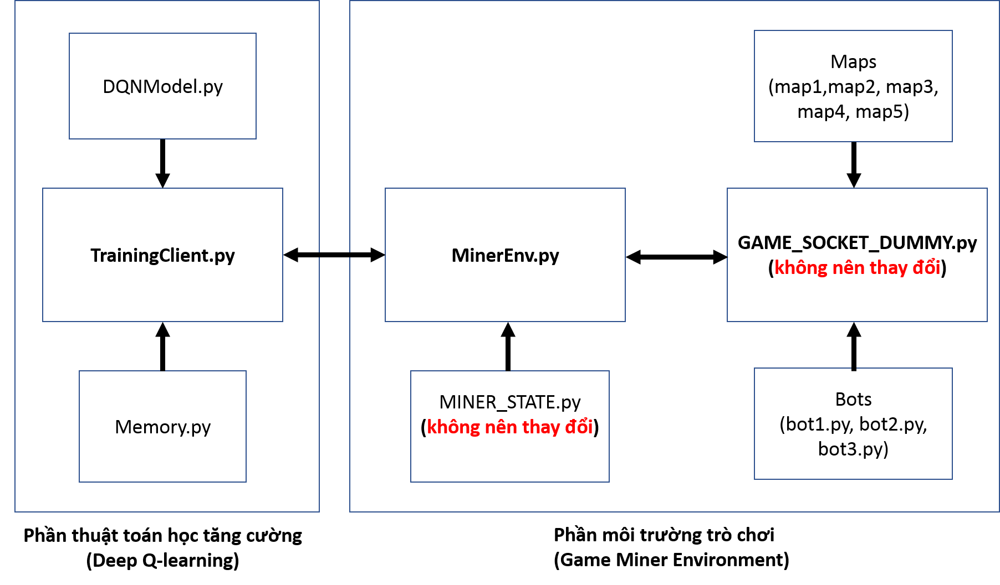
*Figure 1: The information flow between programs in the sample source code
used for training*
Details of the two parts are as follows:
### 1.	Miner Game Environment
The source code of Miner Game Environment is derived from the original source code of Miner Game on Codelearn system. It includes GAME_SOCKET_DUMMY.py, MINER_STATE.py, MinerEnv.py, Maps, and 03 Bots (bot1.py, bot2.py, bot3.py). Figure 2 illustrates the exchange process of map information and Agent's State information between MinerEnv.py and GAME_SOCKET_DUMMY.py. The details of programs are described below.

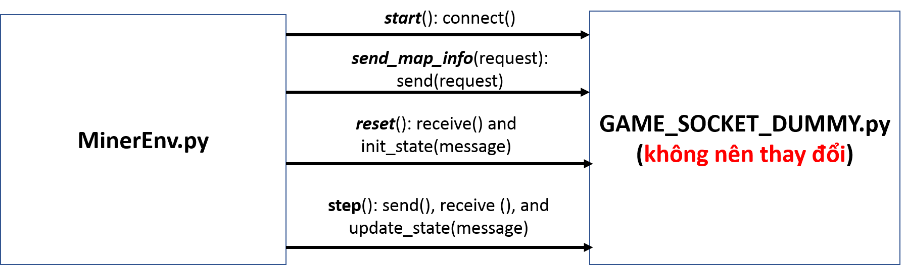
*Figure 2: The information flow between MinerEnv.py and GAME_SOCKET_DUMMY.py during training (simulating the information flow between client and server)s*

a)	MinerEnv.py: A program designed based on the general structure of the reinforcement learning environment to help teams access the main program (GAME_SOCKET_DUMMYpy) in a simple and convenient way. Some of the main functions in the program are as follows:

- **start()**: a single-use function used to simulate the process of connecting to the server to start playing. During training, this function calls the **connect()** function in GAME_SOCKET_DUMMY.py to read 05 maps in Maps folder.

- **send_map_info()**: a function used to select maps to train Agents.

- **reset()**: a function used to initialize a map and a State for the Agent. This function calls the **receive()** function in GAME_SOCKET_DUMMY.py to get the map initial information saved in a json message, as well as the **init_state(message)** function in MINER_STATE.py to update the Agent's State with the map initial information.

- **step()**: a function used to send an action to GAME_SOCKET_DUMMY.py and receive the changes of map information and Agent's State.

- **get_state()**: a function provided as an example of defining a State of the Agent during training. Teams can overwrite this function to define a State that suits their training strategies.

- **get_reward()**: a function provided as an example of defining a reward function of the Agent during training. Teams can overwrite this function to define a reward function that suits their training strategies.
    
b)	MINER_STATE.py (teams should not change the source code in this program): this program is a sample source code for saving the map information and the Agent's State received from GAME_SOCKET_DUMMY.py (which will be sent from the server in the actual competition). This program is designed to help teams manage their State information easily during training. Map and State classes, along with some main functions in these two classes, are as follows:

- **MapInfo** (Class): a class used to store all map information. This class includes max_x, max_y, maxStep, numberOfPlayer, golds (the current amount of remaining gold on the map), obstacles (the information about current obstacles on the map).

  + **update (golds, changedObstacles)**: update the map information after each step.

- **State** (Class): a class that contains the States of the game (including the player's State and map).

  + **init_state(data)**: a function used to initialize the map information and the Agent's State at the beginning of an episode in training (or a match in the actual competition).
  + **update_state(data)**: a function used to update the State of the game after each step. The transferred data includes the map information and the Agent's State.

c)	GAME_SOCKET_DUMMY.py (teams should not change the source code in this program): a program used to simulate gold miner game, including the process of transferring data (message) to the server. This program contains 07 classes: ObstacleInfo, GoldInfo, PlayerInfo, GameInfo, UserMatch, StepState and GameSocket. GameSocket is the main class and contains the following main functions:

- **__ init__ (host, port)**: a function used to initialize the environment. In this function, the purpose of host and port initialization is to simulate the connection on the server in the actual competition.

- **init_bots()**: a function designed to assist the players to train Agent with bots. To specify a bot to participate in training, use the following command: **self.bots = [Bot1(2), Bot2(3), Bot3(4)]**

- **connect()**: a function used to simulate the connection from client to server. In training, the function will upload maps from the Maps folder to the environment.

- **receive()**: a function used to simulate the action in which the client receives messages from the server. During training, if this function is called for the first time, it will return the map initial information and the Agent's initial State. In other cases, it will return the current map information and the Agent's current State.

- **send()**: a function used to simulate the action in which the client sends messages to the server. During training, there are 2 types of messages from the client:

  + Action: an action for the next step, the data type is numeric.

  + Request: a request for parameters to initialize the game environment. The parameters include: map, init_x, init_y, init_energe, max_step. For example, request = "map1,1,2,100,150" means that the server will use the map information (gold, obstacles) from map1 in the Maps folder, the players will start from position (x = 1, y = 2) with an initial energy of 100, and the game will have a maximum of 150 steps.

d)	Maps: The Maps folder. It containing 05 sample maps for training. Information on traps will be the same in these 05 maps, only the positions of gold mines and the amount of gold will change in the preliminary round. Teams may redesign these maps to suit their own training strategies.  Teams need to pay attention to the followings when working with Maps:

- Each file in the Maps folder is considered a map, the filename is the map name.

- Each map is a matrix of integers with the following meanings:
  | ID | Type |
  | ---| ---|
  | 0 | Land |
  | -1 | Woods |
  | -2 | Trap |
  | -3 | Swamp |
  | >0 | Gold |

- Select a training map as follows:

  + Function to select a map in MinerEnv.py file: send_map_info(request)

  + Request structure: {map_name},{init_x},{init_y},{init_energy}

  + For example, request = "map2,4,5,1000" means that map2 will be used for the match,the players will start from position (x = 4, y = 5) with an initial energy of 1000.

e)	Bots (not the bots used in the preliminary round): 3 sample bots (bot1.py, bot2.py, and bot3.py) are provided to teams. Teams can create bots to suit their training strategies.  The bots will be put into play in the game environment via GAME_SOCKET_DUMMY.py. You will need to declare the bots (import Botx) and initialize them (init_bots()). Some of the main functions in the bot source code are as follows:

- **new_game(data)**: a function used to initialize the game environment (including initial map information and the initial state of the bots).
- **new_state(data**) : a function used to update the State received from the server.
- **next_action** : a function used to return an Action for the next step.

### 2.	Deep reinforcement learning algorithm (Deep Q-learning)
In this section, the source code is written based on the Deep reinforcement learning algorithm (Deep Q-learning - DQN). The DQN algorithm has been introduced in a work of Mnih et al ("Human-level control through deep reinforcement learning." Nature 518.7540 (2015): 529-533). The source code contains the following program files: TrainingClient.py, DQNModel.py, and Memory.py.

a)	TrainingClient.py: this program allows communication with the game environment. Some main points in this program are as follows:

- Initialize parameters for the algorithm:

        N_EPISODE = 10000 #The number of episodes for training

        MAX_STEP = 1000 #The number of steps for each episode

        BATCH_SIZE = 32 #The number of experiences used in each training session 

        MEMORY_SIZE = 100000 #The memory capacity to save experiences

        SAVE_NETWORK = 100 # The number of episodes after which the DQN network will be saved

        INITIAL_REPLAY_SIZE = 1000 #The number of experiences required to start training

        INPUTNUM = 198 #The number of inputs for the DQN network

        ACTIONNUM = 6 #The number of actions equivalent to the number of outputs of the DQN network

- Initialize the game environment: 

        minerEnv = MinerEnv(HOST, PORT)

        minerEnv.start()

- Acquire the initial State of the Agent:

        minerEnv.reset() 

        s = minerEnv.get_state()

- Perform an Action:

        action = DQNAgent.act(s)

        minerEnv.step(str(action))

- Acquire the current State of the Agent and reward for the last Action, check the requirements to terminate the episode:

        s_next = minerEnv.get_state()

        reward = minerEnv.get_reward()

        terminate = minerEnv.check_terminate()

- Train the DQN network (put some experiences from Memory to DQNAgent to start training):

        batch = memory.sample(BATCH_SIZE)

        DQNAgent.replay(batch, BATCH_SIZE)

b)	DQNModel.py: this source code is designed to allow the creation of deep learning models and model training functions. Some main points in this program are as follows:

- **Initialize numeric parameters**:

        gamma = 0.99, #The discount factor

        epsilon = 1, #Epsilon - the exploration factor

        epsilon_min = 0.01, #The minimum epsilon 

        epsilon_decay = 0.999,#The decay epislon for each update_epsilon time

        learning_rate = 0.00025, #The learning rate for the DQN network

- **create_model()**: a function used to create a deep network. The network contains 02 hidden layers (each layer has 300 nodes, the activation function of these 02 hidden layers is ReLu) and an output layer (06 nodes corresponding to 06 Q-action values of 06 actions, the activation function is Linear).

- **act(state)**: a function used to return an Action for the Agent at the State.

- **replay(samples, batch_size)**: a function used to train the deep network with experiences from Memory file.

- **update_epsilon()**: a function used to reduce epsilon (exploration factor).

c)	Memory.py: this source code is used to store data (experiences) for training.

**Note**: As the above source code is used for training, the game ends only when the map runs out of gold or the players are eliminated.

### B.	Source code for competition -Miner-Testing-CodeSample

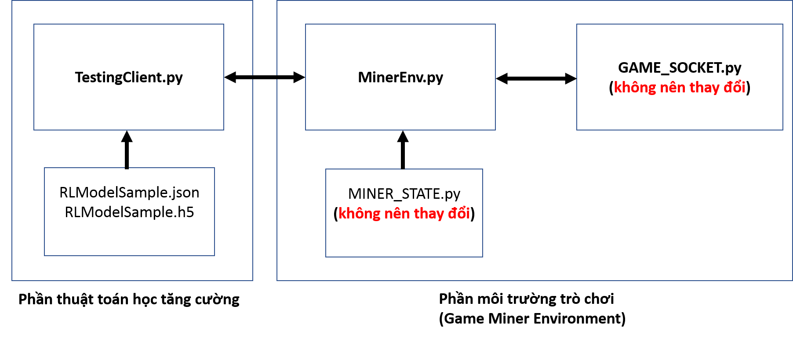
*Figure 3: The information flow between programs in the sample source code used in the competition*
- A source code designed for teams to use in official competitions. 

- The difference between this and the source code provided for training (Miner-Training-Local-CodeSample) is that this source code uses GAME_SOCKET.py instead of GAME_SOCKET_DUMMY.py. GAME_SOCKET.py allows data transfer to the server. 

- Information on the HOST and PORT of the server is taken from the environment variables when TestingAgent.py is executed.

- The other source code (MINER_STATE.py and MinerEnv.py) is similar to that provided for training (Miner-Testing-CodeSample).

- In the source code, a trained DQN model (RLModelSample.json, RLModelSample.h5) is provided as an example for uploading a model in the competition (Note: the model has not been fully trained to be able to compete). In particular, the json file stores the network parameters and the h5 file stores the network weight.


## MinerAI environment installation

This guideline is provided for users to install Python environment with libraries used at server, facilitating the running of the test code.

The environment can be installed in two ways.:

- Install the environment directly on your PC:
  - Advantages: easy and familiar to those who have worked with Python
  - Disadvantages: there may be difference to the actual running environment due to different OS (the actual environment in which the server runs your code is Ubuntu Server 18.04)

- Using Docker to install:
  - Advantages: the code environment is similar to the actual running environment
  - Disadvantages: installing Docker may be difficult for some older OS

Installation instructions:
- Python 3.6.9 (Ubuntu) – python 3.7.4 (windows)
- Tensorflow 1.14.0
- Keras 2.3.1
- Numpy 1.18.4
- Pandas 0.15
- PyTorch 1.5.0

1. Installing directly
   1. Windows
      1. Install Python 3.7.4:

           Download the executable installer relevant to the OS on your PC at: https://www.python.org/downloads/release/python-374/ 

            (The download link is located in the Files section at the bottom of the page)

            Install and set Windows environment variables to PYTHON_HOME /, PYTHON_HOME / Scripts

            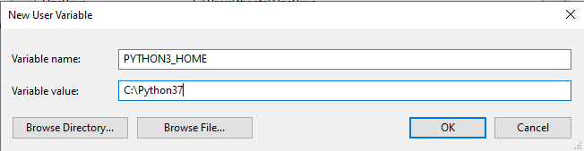
            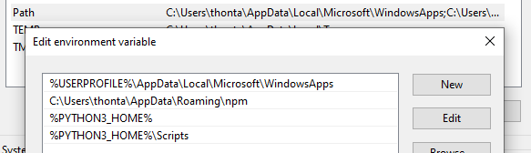

            Verify the installation, make sure the version is 3.7.4

            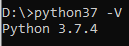
      2. Install pip3:

            Run the following command to install:
            ```
            python37 -m pip install --upgrade pip
            ```
            Verify the installation, make sure pip3 is installed in Python37
            
            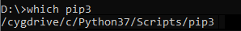
      3. Install virtualenv:

           Run the following command to install:
            ```
            pip3 install virtualenv
            ```

            Verify the installation, make sure virtualenv is installed in Python37

            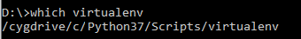
      4. Install libraries:

           In order not to affect the normal Python environment, the installation will be done in a virtual environment.

           - Change the current directory to the directory you want to install and create a virtual environment:
                ```
                virtualenv -p python37 {env_name}
                ```
                **{env_name}**: an environment's name of your choice.

                For example, if you want to name the environment as Miner, the installation command will be:
                ```
                virtualenv -p python37 miner
                ```
            - Activate the virtual environment
                ```
                .\{env_name}\Scripts\activate
                ```
            - Install libraries:
                ```
                pip3 install numpy==1.18.4
                pip3 install keras==2.3.1
                pip3 install pandas==1.0.4
                pip3 install tensorflow==1.14.0
                pip3 install torch==1.5.0+cpu torchvision==0.6.0+cpu -f https://download.pytorch.org/whl/torch_stable.html
                ```
            - Run code: the code is run in the virtual environment set up in the previous step, therefore, make sure to activate the virtual environment in advance.
   2. Ubuntu 18.04
      1. Install Python 3.6.9:

            Installation commands:
            ```
            apt-get update
            apt-get install python3
            ```
            (See here on how to install in other OS versions: https://askubuntu.com/questions/865554/how-do-i-install-python-3-6-using-apt-get)

            Verify if the right version is installed:

            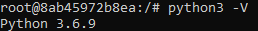
      2. Install pip:

            Run the following command to install:
            ```
            python3 -m pip install --upgrade pip
            ```
            Or
            ```
            sudo apt install python3-pip
            ```
      3. Install virtualenv:
           
           Run the following command to install:
            ```
            pip3 install virtualenv
            ```
      4. Install libraries:

           In order not to affect the normal Python environment, the installation will be done in a virtual environment.

           - Change the current directory to the directory you want to install and create a virtual environment:
                ```
                virtualenv -p python3 {env_name}
                ```
                **{env_name}**: an environment's name of your choice.

                For example, if you want to name the environment as Miner, the installation command will be:
                ```
                virtualenv -p python3 miner
                ```
            - Activate the virtual environment:
                ```
                cd {env_name}/bin
                source ./activate
                ```
            - Install libraries:
                ```
                pip3 install numpy==1.18.4
                pip3 install keras==2.3.1
                pip3 install pandas==0.15
                pip3 install tensorflow==1.14.0
                pip3 install torch==1.5.0+cpu torchvision==0.6.0+cpu -f https://download.pytorch.org/whl/torch_stable.html
                ```
            - Run code: the code is run in the virtual environment set up in the previous step, therefore, make sure to activate the virtual environment in advance.
2. Using Docker

    We will provide a Docker image which has installed all the environments similar to the actual server environment.

    In this section, we will show you how to install the Docker, and how to use the image we provide.

   1. Install Docker

        You can easily look for comprehensive and detailed instructions to install Docker on the internet. Below are just some examples.

       1. Windows:

            - Windows 10: Visit the link below to download the installer and install on your PC:
            https://hub.docker.com/editions/community/docker-ce-desktop-windows/
            - Windows 7: Follow the instructions at: https://webme.ie/how-to-install-docker-on-windows-7/
       2. Ubuntu:
            - Ubuntu 18.04: Follow the instructions at:
            https://www.digitalocean.com/community/tutorials/how-to-install-and-use-docker-on-ubuntu-18-04
            - Ubuntu 16.04: Follow the instructions at: https://docs.docker.com/engine/install/ubuntu/
   2. Use Doker image
       1. Pull image:

            Execute the following command to pull image
            ```
            docker pull codelearnio/miner-ai:training
            ```

            Verify if the image has been successfully pulled by the following command: 
            ```
            docker images –a
            ```
            The displayed information will include the Docker image with the following details:
            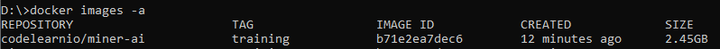

       2. Use image:

            This section will instruct you to use some basic commands in Docker container.
            
            For other commands, refer to the following link:
            https://docs.docker.com/engine/reference/commandline/docker/

            - Create and run the Docker container from the existing image:
                
                Create and run the Docker container with the provided Docker image by the following command:
                ```
                docker run -it -v {WORKING_DIR}:/v b71e2ea7dec6
                ```
                Note: **{WORKING_DIR}** lis the path to the directory where your source is located;

                For example: if you put the source code in **D:\MinerAI** directory, the run command will be:
                ```
                docker run -it -v D:\MinerAI:/v b71e2ea7dec6
                ```
                You can name the container by adding parameters: **--name={name}**
                
                Change the current directory to the binded directory: **cd /v**
                
                Check the files binded to the container: **ls**
                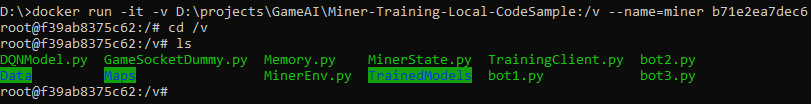
                Then execute run **python3** command with your source code without any additional installation..

                For example: 
                ```
                python3 TrainingClient.pyt
                ```
            - Check the existing containers:
                ```
                docker container ls -a
                ```
                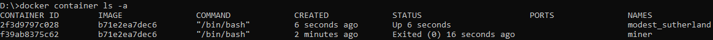
                As shown above, there are 2 containers initialized from the image **b71e2ea7dec6**: container **2f3d9797c028**  is up running while container, container **f39ab8375c62** has stopped

            - Attach to a running Docker:
                ```
                docker attach {container_id}
                ```
                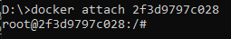

               Note: You can replace ***{container_id}*** with ***{container_name}***
            - Start a stopped Docker container:
                ```
                docker start –a {container_id}
                ```
                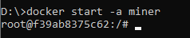
            - Stop a running container:
                ```
                docker stop {container_id}
                ```
            - Remove a Docker container:
                ```
                docker rm {container_id}
                ```


***

***Vietnamese version***
## Mô Tả Mã Nguồn Mẫu: Huấn Luyện và Thi đấu

Trong quá trình thi đấu, thông tin trạng thái (State) được trả về sau khi thực hiện hành động (Action) bao gồm:

-   Thông tin của những agent đang thi đấu

  ```json
  {
        "playerId" tên định danh của agent, kiểu integer; 
        "posx": vị trí theo tọa độ x của agent, kiểu integer;
        "posy": vị trí theo tọa độ y của agent, kiểu integer;
        "score": số vàng agent đào được, kiểu integer;
        "energy": số năng lượng còn lại của agent, kiểu integer;
        "lastAction": lưu action vừa thực hiện, kiểu integer
  }
  ```
- Thông tin các vật cản còn lại trên bản đồ (vị trí và số năng lượng sẽ bị trừ khi một agent đi qua).
- Thông tin số bãi vàng còn lại trên bản đồ (vị trí và số vàng).
- Kích thước của bản đồ (chiều cao và độ rộng).

Từ thông tin State được trả về trên, các đội chơi quyết định chiến lược huấn luyện riêng như thiết kế hàm thưởng (Reward Function) và định nghĩa không gian State (State Space). Trong hai mã nguồn mẫu **(Miner-Training-Local-CodeSample và Miner-Testing-CodeSample)** được cung cấp cho các đội chơi (được mô tả ở phía dưới),chúng tôi đưa ra một ví dụ về việc thiết kế Reward Function và định nghĩa State Space lần lượt trong 02 hàm *get_state()* và *get_reward()*. Dưới đây là mô tả tổng quan về hai mã nguồn được cung cấp cho việc huấn luyện và thi đấu::
## A. Mã nguồn cho huấn luyện - Miner-Training-Local-CodeSample
Đây là mã nguồn (source code) mẫu được sử dụng cho quá trình huấn luyện tại máy của các đội chơi. Mã nguồn bao gồm 02 phần chính: môi trường trò chơi đào vàng (Miner Game Environment) và thuật toán học tăng cường (Deep-Q learning -DQN). Hình 1 cung cấp cái nhìn trực quan về luồng trao đổi thông tin giữa các chương trình. 


*Hình 1: Luồng trao đổi thông tin giữa các chương trình trong mã nguồn mẫu
được sử dụng trong Huấn luyện*


Chi tiết của hai phần như sau:
### 1.	Phần môi trường trò chơi đào vàng (Miner Game Environment).
Mã nguồn của môi trường được lấy từ mã nguồn gốc của trò chơi đào vàng (Miner Game) trên hệ thống Codelearn. Mã nguồn bao gồm: GAME_SOCKET_DUMMY.py, MINER_STATE.py, MinerEnv.py, Maps, và 03 Bots (bot1.py, bot2.py, bot3.py). Hình 2 mô tả quá trình trao đổi về thông tin bản đồ và trạng thái của agent giữa MinerEnv.py và GAME_SOCKET_DUMMY.py. Mô tả chi tiết các chương trình được miêu tả phía dưới:


*Hình 2: Luồng trao đổi thông tin giữa MinerEnv.py và GAME_SOCKET_DUMMY.py được mô phỏng giữa client và server trong Huấn luyện*

a) MinerEnv.py: Chương trình được thiết kế theo cấu trúc chung của môi trường học tăng cường (Reinforcement learning environment) cho phép các đội chơi truy cập tới chương trình chính (GAME_SOCKET_DUMMY.py) đơn giản và thuận tiện. Một số hàm chính trong chương trình như sau:


- **start()**: hàm dùng một lần duy nhất với mục đích mô phỏng lại quá trình kết nối tới server để bắt đầu chơi. Trong Training, hàm này gọi tới hàm **connect()** trong GAME_SOCKET_DUMMY.py để đọc 05 maps trong tệp Maps.

- **send_map_info()**: hàm được sử dụng nhằm mục đích chọn map để huấn luyện agent.

- **reset()**: hàm được sử dụng nhằm mục đích khởi tạo map và state cho agent. Hàm này sẽ gọi tới hàm **receive()** trong GAME_SOCKET_DUMMY.py để lấy thông tin ban đầu của map được lưu trong một message định dạng json, và hàm **init_state(message)** trong MINER_STATE.py để cập nhật thông tin ban đầu của map tới state của agent.

- **step()**: hàm được sử dụng nhằm mục đích gửi một hành động (action) tới GAME_SOCKET_DUMMY.py, và sẽ nhận về thông tin bản đồ (map) và trạng thái (state) của agent thay đổi.

- **get_state()**: hàm được cung cấp như một ví dụ cho việc định nghĩa một trạng thái (state) của agent cho quá trình huấn luyện. Các đội chơi tùy vào chiến lược huấn luyện riêng có thể viết lại hàm để đưa ra được state của agent phù hợp.

- **get_reward()**: hàm được cung cấp như một ví dụ cho việc định nghĩa một hàm thưởng (reward function) của agent cho quá trình huấn luyện. Các đội chơi tùy vào chiến lược huấn luyện riêng có thể viết lại hàm để đưa ra được hàm reward function cho phù hợp.
    
b)	MINER_STATE.py ***(Các đội chơi không nên thay đổi mã nguồn trong chương trình)***: Chương trình là mã nguồn mẫu cho việc lưu thông tin bản đồ (map) và trạng thái (state) của agent nhận được từ GAME_SOCKET_DUMMY.py (trong thi đấu sẽ nhận từ server). Chương trình được thiết kế giúp cho các đội chơi quản lý state dễ dàng trong quá trình huấn luyện. Hai lớp (class) map và state cùng với một số hàm chính trong hai lớp như sau:

- **MapInfo** (Class): Là lớp dùng cho việc lưu trữ toàn bộ thông tin của bản đồ. Bao gồm: max_x, max_y, maxStep, numberOfPlayer, golds: số vàng còn lại trên map tại thời điểm hiện tại, obstacles: thông tin các vật cản hiện tại trên bản đồ.
  + **update (golds, changedObstacles)**: cập nhật lại thông tin bản đồ sau mỗi bước (step).

- **State** (Class): là lớp chứa trạng thái (state) của trò chơi (bao gồm trạng thái của người chơi và bản đồ).

  + **init_state(data)**: hàm khởi tạo thông tin của bản đồ (map) và trạng thái (state) của agent tại thời điểm bắt đầu một episode trong training (hay một trận đấu trong thi đấu).
  + **update_state(data)**: hàm cập nhật trạng thái (state) của trò chơi sau mỗi lượt chơi (step). Data được truyền vào bao gồm thông tin bản đồ và trạng thái của agent.

c)	GAME_SOCKET_DUMMY.py ***(Các đội chơi không nên thay đổi mã nguồn trong chương trình)*** : Chương trình mô phỏng lại trò chơi đào vàng bao gồm cả quá trình truyền nhận dữ liệu (message) tới máy chủ (server). Chương trình bao gồm 07 lớp (class) : ObstacleInfo, GoldInfo, PlayerInfo, GameInfo, UserMatch, StepState,và GameSocket. Trong đó, lớp GameSocket là lớp chính gồm những hàm chính sau:

- **__ init__ (host, port)**: a function used to initialize the environment. In this function, the purpose of host and port initialization is to simulate the connection on the server in the actual competition.

- **init_bots()**:hàm được thiết kế để hỗ trợ người chơi huấn luyện agent với bot. Để chỉ định bot tham gia vào huấn luyện, sử dụng dòng lệnh sau : **self.bots = [Bot1(2), Bot2(3), Bot3(4)]**.

- **connect()**: hàm này mô phỏng hành động connect từ client đến server. Trong huấn luyện, hàm sẽ tải các bản đồ từ tệp Maps lên môi trường.

- **receive()**: hàm này mô phỏng hành động client nhận message từ server. Trong huấn luyện, hàm sẽ trả về thông tin bản đồ ban đầu cũng như trạng thái ban đầu của agent nếu lần đầu được gọi, và sẽ trả về thông tin bản đồ hiện tại cũng như trạng thái hiện tại của agent.

- **send()**: hàm này mô phỏng hành động client gửi message lên server. Trong huấn luyện, sẽ có 2 kiểu message từ client:

  + Action: là hành động cho step tiếp theo và là kiểu số.

  + Request: là yêu cầu các thông số cho việc khởi tạo môi trường trò chơi. Các thông số bao gồm: (map, init_x, init_y, init_energe, max_step). Ví dụ: request = “map1,1,2,100,150” sẽ hiểu là server sẽ sử dụng thông tin bản đồ (vàng, vật cản) theo map1 trong tệp Maps, khởi tạo vị trí ban đầu cho người chơi tại ô (x = 1, y = 2), với năng lượng ban đầu là 100, và trận đấu có tối đa 150 lượt chơi (step).

d)	Maps: Thư mục Maps chứa 05 bản đồ (map) mẫu phục vụ cho việc huấn luyện. Thông tin về bẫy trong 05 bản đồ là được giữ nguyên, và chỉ thay đổi vị trí vàng và số lượng vàng trong vòng sơ loại. Đội chơi có thể thiết kế lại những bản đồ này cho phù hợp với chiến lược huấn luyện riêng. Một số nội dung cần chú ý khi các đội chơi làm việc với Maps như sau:

- Mỗi file trong thư mục Maps được xem là một bản đồ, tên của file (filename) được xem là tên của bản đồ (map name).

- Mỗi bản đồ là một ma trận các số nguyên với ý nghĩa như sau:
  | ID | Type |
  | ---| ---|
  | 0 | Đất |
  | -1 | Rừng |
  | -2 | Bẫy |
  | -3 | Đầm lầy |
  | >0 | Vàng |


- Chọn bản đồ trong huấn luyện như sau:

  + Hàm chọn bản đồ trong file MinerEnv.py : send_map_info(request)

  + Cấu trúc của request: {map_name},{init_x},{init_y},{init_energy}

  + Ví dụ: request = "map2,4,5,1000" - là trận đấu sẽ sử dụng map2, người chơi (players) xuất phát từ tọa độ: x = 4, y = 5 với năng lượng (energy) được khởi tạo là 1000.

e)	Bots ***(không phải các bots được dùng trong vòng sơ loại)***: 03 bots (bot1.py, bot2.py, và bot3.py) được cung cấp mẫu cho các đội chơi. Các đội chơi có thể tạo những bot theo chiến lược huấn luyện riêng. Các bots sẽ được đưa vào trong môi trường trò chơi trong GAME_SOCKET_DUMMY.py. Bao gồm 02 bước: khai báo bots (import Botx) và khởi tạo bot (init_bots()). Một số hàm chính trong những mã nguồn bot như sau:

- **new_game(data)**: hàm thực hiện khởi tạo môi trường trò chơi (bao gồm thông tin bản đồ và trạng thái ban đầu cho bot).
- **new_state(data)**: hàm cập nhật trạng thái (state) nhận được từ server.
- **next_action**: hàm trả về một hành động (action) cho bước (step) tiếp theo.

### 2.	Phần thuật toán học tăng cường (Deep Q-learning)
Trong phần này, mã nguồn được viết theo thuật toán học tăng cường sâu (Deep Q-learning - DQN). Nguồn thuật toán được giới thiệu trong nghiên cứu của Mnih et al *("Human-level control through deep reinforcement learning." Nature 518.7540 (2015): 529-533)*. Mã nguồn thuật toán bao gồm những file chương trình sau: TrainingClient.py, DQNModel.py, và Memory.py.

a)	TrainingClient.py: đây là mã nguồn của thuật toán DQN cho phép giao tiếp với phần môi trường trò chơi. Trong chương trình này, một số phần cần chú ý như sau:

- Khởi tạo các tham số cho thuật toán:

        N_EPISODE = 10000 #Số episode cho huấn luyện
        MAX_STEP = 1000 #Số bước (step) cho mỗi episode
        BATCH_SIZE = 32 #Số trải nghiệm (experiences) được sử dụng cho môi lần huấn luyện
        MEMORY_SIZE = 100000 #Kích thước bộ nhớ lưu những trải nghiệm
        SAVE_NETWORK = 100 #Sau số episode này, mạng DQN sẽ được lưu lại
        INITIAL_REPLAY_SIZE = 1000 #Số trải nghiệm cần phải có trong bộ nhớ để bắt đầu huấn luyện.
        INPUTNUM = 198 #Số đầu vào cho mạng DQN
        ACTIONNUM = 6 #Số hành động tương đương số đầu ra của mạng DQN

- Khởi tạo môi trường trò chơi: 

        minerEnv = MinerEnv(HOST, PORT)

        minerEnv.start()

- Lấy trạng thái (state) ban đầu của agent:

        minerEnv.reset() 

        s = minerEnv.get_state()

- Thực hiện hành động (action):

        action = DQNAgent.act(s)

        minerEnv.step(str(action))

-Lấy trạng thái mới của agent, phần thưởng (reward) cho hành động vừa thực hiện, và kiểm tra điều kiện kết thúc episode:

        s_next = minerEnv.get_state()

        reward = minerEnv.get_reward()

        terminate = minerEnv.check_terminate()

- Huấn luyện mạng DQN (lấy một số trải nghiệm (experiences) từ Memory, và đưa vào DQNAgent để huấn luyện):

        batch = memory.sample(BATCH_SIZE)

        DQNAgent.replay(batch, BATCH_SIZE)

b)	DQNModel.py: mã nguồn này được thiết kế cho phép tạo những mô hình học sâu (deep learning models) và những hàm huấn luyện mô hình. Trong chương trình này, một số phần cần chú ý như sau:

- Khởi tạo tham số học:

        gamma = 0.99, #The discount factor

        epsilon = 1, #Epsilon - the exploration factor

        epsilon_min = 0.01, #The minimum epsilon 

        epsilon_decay = 0.999,#The decay epislon for each update_epsilon time

        learning_rate = 0.00025, #The learning rate for the DQN network

- create_model(): hàm được sử dụng để tạo một mạng sâu (deep network). Mạng chứa 02 lớp ẩn (hidden layers), mỗi lớp có 300 nút (node), hàm kích hoạt (activation) của hai lớp ẩn là ReLu, và một lớp đầu ra có 06 nút (node) tương ứng với 06 giá trị Q-action của 06 actions với hàm kích hoạt là Linear.

- act(state): hàm trả về hành động cho agent tại trạng thái state.

- replay(samples, batch_size): hàm được sử dụng để huấn luyện mạng sâu từ những trải nghiệm (experiences) lấy ra từ Memory file.

- update_epsilon(): hàm thực hiện việc giảm epsilon hay giảm tham dò (exploration).

c)	Memory.py: mã nguồn được sử dụng để lưu dữ liệu (experiences) cho việc huấn luyện.

**Chú ý**: Mã nguồn trên được dùng cho việc huấn luyện nên trận đấu kết thúc chỉ khi hết vàng trên bản đồ (map) hoặc người chơi bị loại (khi hết vàng hoặc ra khỏi bản đồ).

### B.	Mã nguồn thi đấu -Miner-Testing-CodeSample


*Hình 3: Luồng trao đổi thông tin giữa các chương trình trong mã nguồn mẫu được sử dụng trong thi đấu.*
-  Mã nguồn được thiết kế cho các đội chơi sử dụng để tham gia cuộc thi chính thức.
-  Điểm khác với mã nguồn cung cấp cho phần huấn luyện (Miner-Training-Local-CodeSample) đó là sử dụng GAME_SOCKET.py thay cho GAME_SOCKET_DUMMY.py. Chương trình GAME_SOCKET.py cho phép truyền nhận dữ liệu tới máy chủ (server).
-  HOST và PORT của server được lấy từ biến môi trường khi run TestingAgent.py
-  Những mã nguồn còn lại (MINER_STATE.py và MinerEnv.py) được giữ nguyên như trong mã nguồn được cung cấp cho huấn luyện (Miner-Testing-CodeSample).
-  Trong mã nguồn, một DQN model (RLModelSample.json, RLModelSample.h5) đã được huấn luyện được cung cấp để làm ví dụ cho việc tải model lên thi đấu (Chú ý: model trên chưa được huấn luyện đầy đủ để có thể thi đấu). Trong đó, file định dạng json lưu tham số mạng và file định dạng h5 lưu trọng số của mạng.


## Cài đặt môi trường MinerAI

Phần này hướng dẫn người dùng cài đặt môi trường python với các thư viện được sử dụng ở server, giúp cho việc chạy thử nghiệm code được chính xác hơn.

Trong này, chúng tôi sẽ hướng dẫn các bạn cài đặt môi trường theo 2 cách:

- Cài đặt môi trường trực tiếp trên máy tính:
  - Ưu điểm: dễ thực hiện, quen thuộc với các bạn đã từng code và cài đặt python
  - Nhược điểm: có thể sẽ có chênh lệch so với môi trường chạy thực tế do hệ điều hành khác nhau (Môi trường thực tế mà server sẽ run code của các bạn là Ubuntu Server 18.04)

- Cài đặt sử dụng docker:
  - Ưu điểm: sao chép được môi trường code giống với môi trường chạy thực tế
  - Nhược điểm: việc cài đặt docker có thể sẽ có khó khăn với một số hệ điều hành cũ

Nội dung cài đặt:
- Python 3.6.9 (Ubuntu) – python 3.7.4 (windows)
- Tensorflow 1.14.0
- Keras 2.3.1
- Numpy 1.18.4
- Pandas 0.15
- PyTorch 1.5.0

1. Run trực tiếp
   1. Windows
      1. Cài đặt python 3.7.4:

            Download bản executable installer cho OS tương ứng từ: https://www.python.org/downloads/release/python-374/ 

            (Link download được đặt ở mục Files phía cuối trang)

            Thực hiện cài đặt và setup biến môi trường windows đến PYTHON_HOME/, PYTHON_HOME/Scripts

            
            

            Kiểm tra cài đăt, đảm bảo version là 3.7.4

            
      2. Cài đặt pip3:

            Chạy lệnh sau để thực hiện cài đặt:
            ```
            python37 -m pip install --upgrade pip
            ```
            Kiểm tra cài đặt, đảm bảo pip3 được cài đặt trong Python37
            
            
      3. Cài đặt virtualenv:

           Chạy lệnh sau để thực hiện cài đặt:
            ```
            pip3 install virtualenv
            ```

            Kiểm tra cài đặt, đảm bảo virtualenv được cài đặt trong Python37

            
      4. Cài đặt thư viện:

           Để không ảnh hưởng đến môi trường python chung, việc cài đặt sẽ được thực hiện trên môi trường ảo.

           - Chuyển thư mục hiện thời về thư mục bạn muốn cài đặt và thực hiện tạo môi trường ảo:
                ```
                virtualenv -p python37 {env_name}
                ```
                {env_name}: là tên môi trường do bạn tự chọn.

                Ví dụ, nếu bạn muốn đặt tên môi trường là miner thì lệnh cài đặt sẽ là:
                ```
                virtualenv -p python37 miner
                ```
            - Kích hoạt môi trường ảo
                ```
                .\{env_name}\Scripts\activate
                ```
            - Cài đặt thư viện:
                ```
                pip3 install numpy==1.18.4
                pip3 install keras==2.3.1
                pip3 install pandas==1.0.4
                pip3 install tensorflow==1.14.0
                pip3 install torch==1.5.0+cpu torchvision==0.6.0+cpu -f https://download.pytorch.org/whl/torch_stable.html
                ```
            - Run code: code được run ở môi trường ảo mà bạn cài ở step trước, vì thế đừng quên kích hoạt môi trường ảo trước khi run nhé!
   2. Ubuntu 18.04
      1. Cài đặt python 3.6.9:

            Các lệnh cài đặt:
            ```
            apt-get update
            apt-get install python3
            ```
            (Tham khảo thêm cách cài đặt ở các version OS khác ở: https://askubuntu.com/questions/865554/how-do-i-install-python-3-6-using-apt-get)

            Kiểm tra cài đặt đúng version:

            
      2. Cài đặt pip:

            Run lệnh sau để cài đặt:
            ```
            python3 -m pip install --upgrade pip
            ```
            Hoặc
            ```
            sudo apt install python3-pip
            ```
      3. Cài đặt virtualenv:
           
           Chạy lệnh sau để thực hiện cài đặt:
            ```
            pip3 install virtualenv
            ```
      4. Cài đặt thư viện:

           Để không ảnh hưởng đến môi trường python chung, việc cài đặt sẽ được thực hiện trên môi trường ảo.

           - Chuyển thư mục hiện thời về thư mục bạn muốn cài đặt và thực hiện tạo môi trường ảo:
                ```
                virtualenv -p python3 {env_name}
                ```
                {env_name}: là tên môi trường do bạn tự chọn.

                Ví dụ, nếu bạn muốn đặt tên môi trường là miner thì lệnh cài đặt sẽ là:
                ```
                virtualenv -p python3 miner
                ```
            - Kích hoạt môi trường ảo
                ```
                cd {env_name}/bin
                source ./activate
                ```
            - Cài đặt thư viện:
                ```
                pip3 install numpy==1.18.4
                pip3 install keras==2.3.1
                pip3 install pandas==0.15
                pip3 install tensorflow==1.14.0
                pip3 install torch==1.5.0+cpu torchvision==0.6.0+cpu -f https://download.pytorch.org/whl/torch_stable.html
                ```
            - Run code: code được run ở môi trường ảo mà bạn cài ở step trước, vì thế đừng quên kích hoạt môi trường ảo trước khi run nhé!
2. Sử dụng docker

    Chúng tôi cung cấp cho các bạn docker image mà đã cài đặt đủ các môi trường giống như ở môi trường server thật.

    Ở phần này, chúng tôi sẽ hướng dẫn cho bạn cách cài đặt docker, và cách sử dụng image mà chúng tôi cung cấp

   1. Cài đặt Docker

        Việc cài đặt Docker được hướng dẫn khá đầy đủ và chi tiết ở nhiều nguồn trên internet, vì thế chúng tôi xin phép chỉ cung cấp các link hướng dẫn mà chúng tôi đã thử nghiệm thực hiện theo thành công.

       1. Windows:

            - Windows 10: truy cập vào đường link dưới đây để download bộ cài và thực hiện cài đặt trên máy tính:
            https://hub.docker.com/editions/community/docker-ce-desktop-windows/
            - Windows 7: thực hiện việc cài đặt theo đường link sau: https://webme.ie/how-to-install-docker-on-windows-7/
       2. Ubuntu:
            - Ubuntu 18.04: Thực hiện cài đặt theo hướng dẫn ở đường link sau:
            https://www.digitalocean.com/community/tutorials/how-to-install-and-use-docker-on-ubuntu-18-04
            - Ubuntu 16.04: Thực hiện cài đặt theo hướng dẫn ở đường link sau: https://docs.docker.com/engine/install/ubuntu/
   2. Sử dụng docker image
       1. Pull image:

            Thực hiện lệnh sau để pull image về
            ```
            docker pull codelearnio/miner-ai:training
            ```

            Kiểm tra image đã được pull về thành công bằng lệnh: 
            ```
            docker images –a
            ```
            Thông tin được hiển thị ra sẽ bao gồm docker image có thông tin dưới đây:
            

       2. Sử dụng image:

            Ở phần này, chúng tôi hướng dẫn bạn sử dụng 1 số lệnh cơ bản với docker container.
            
            Để tìm hiểu thêm các lệnh khác, các bạn có thể tham khảo ở đường link sau:
            https://docs.docker.com/engine/reference/commandline/docker/

            - Tạo mới và run docker container từ image có sẵn:
                
                Tạo và run docker container với docker image được cung cấp bằng lệnh sau:
                ```
                docker run -it -v {WORKING_DIR}:/v b71e2ea7dec6
                ```
                Note: **{WORKING_DIR}** là path dẫn đến thư mục chứa source của bạn;

                Ví dụ: bạn để source code ở thư mục **D:\MinerAI** thì lệnh run của bạn sẽ là:
                ```
                docker run -it -v D:\MinerAI:/v b71e2ea7dec6
                ```
                Bạn có thể đặt tên container bằng cách thêm tham số: **--name={name}**
                
                Chuyển thư mục hiện thời về thư mục đã được bind: **cd /v**
                
                Kiểm tra các file đã được bind vào container: **ls**
                
                Tại đây bạn có thể thực hiện lệnh run **python3** với source code của bạn mà không cần phải cài đặt gì thêm.

                Ví dụ: 
                ```
                python3 TrainingClient.pyt
                ```
            - Kiểm tra các container đang có:
                ```
                docker container ls -a
                ```
                
                Với hiển thị như ở hình trên, ta thấy đang có 2 container được khởi tạo từ image **b71e2ea7dec6**, container **2f3d9797c028**  đang run, container **f39ab8375c62** đã stop

            - Attach docker đang chạy:
                ```
                docker attach {container_id}
                ```
                

                Note: bạn có thể thay thế ***{container_id}*** bằng ***{container_name}***
            - Start docker đang stop:
                ```
                docker start –a {container_id}
                ```
                
            - Stop container đang run:
                ```
                docker stop {container_id}
                ```
            - Remove docker container:
                ```
                docker rm {container_id}
                ```